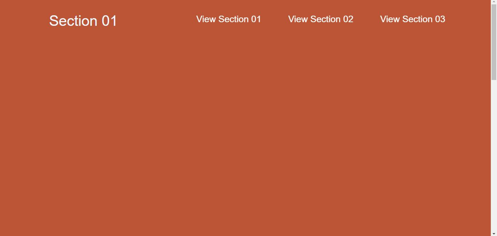
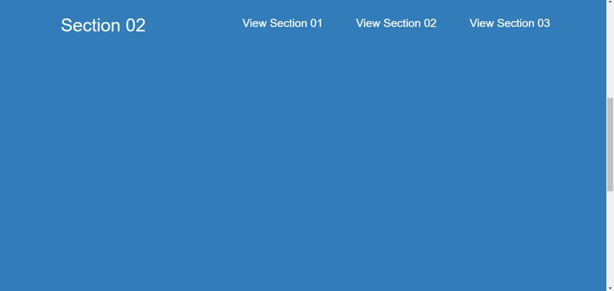
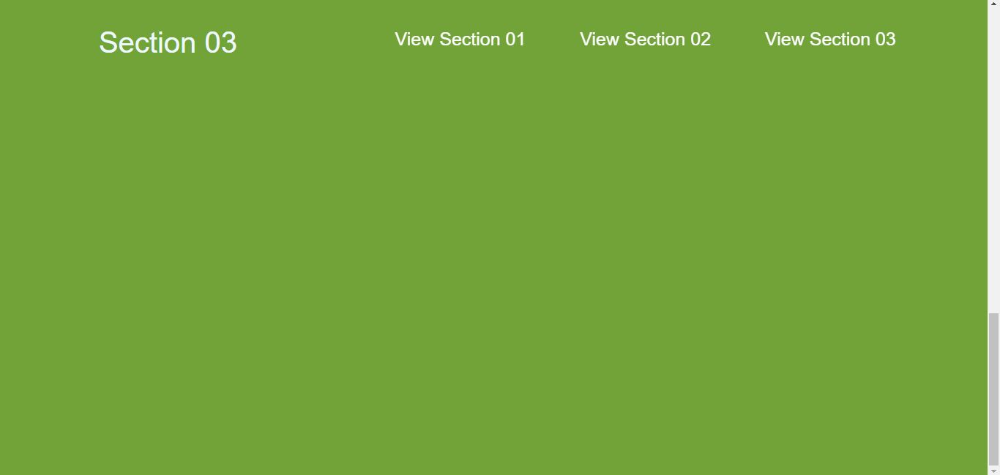

# Smooth-Scroll-with-CSS
Smooth scroll effect to web page without javascript

##### First of all, I have created a basic structure with HTML. And I have added three different kinds of sections. Also, navigation is fixed to page top. Then the user can click navigation buttons to navigate separate sections with smooth scrolling.






##### This stuff is easy you can do by adding a single line of CSS code.

```
/*Smooth Scroll Style*/

html {
    scroll-behavior: smooth;
}

```


